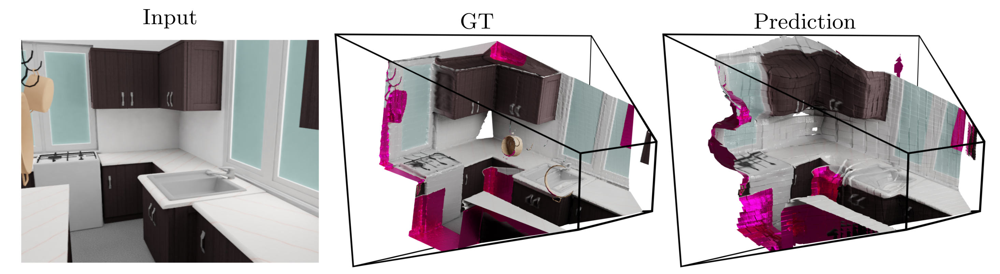

# Single View Reconstruction

## 3D Scene Reconstruction from a Single Viewport

Maximilian Denninger and Rudolph Triebel

Accepted paper at ECCV 2020. [paper], [short-video], [long-video]

## Citation

If you find our work useful, please cite us with: 

```
bibkey
```

## Overview

<p align="center">

</p>

This repository contains everything necessary to completely reproduce the results presented in our paper. 
This includes the generation of the data and the training of our model.
Be aware, that the generation of the data is time consuming as each process is optimized to maximum but still billions of truncated signed distance values and weights have to be calculated.
Including of course all the color and normals images. 
The data used for the training of our model was after compression around 1 TB big. 

As SUNCG is not longer available, we can not upload the data, we used for training as it falls under the the SUNCG blocking.
If you do not have access to the SUNCG dataset, you can try use the 3D-Front dataset and change the necessary code parts.

### Data generation

This is a quick overview over the data generation process, it is all based on the SUNCG house files.

<p align="center">

</p>

1. The SUNCG house.json file is converted with the SUNCGToolBox in a house.obj and camerapositions file, for more information: [SUNCG](SUNCG)
2. Then, these two files are used to generate the TSDF voxelgrids, for more information: [SDFGen](SDFGen)
3. The voxelgrid is used to calculate the loss weights via the [LossCalculatorTSDF](LossCalculatorTSDF)
4. They are used to first the train an autoencoder and then compress the 512³ voxelgrids down to a size of 32³x64, which we call encoded. See [CompressionAutoEncoder](CompressionAutoEncoder).
5. Now only the color & normal images are missing, for that we use [BlenderProc](https://github.com/DLR-RM/BlenderProc) with the config file defined in [here](BlenderProc).

These are then combined with this [script](SingleViewReconstruction/generate_tf_records.py) to several tf records, which are then used to train our SingleViewReconstruction network.


