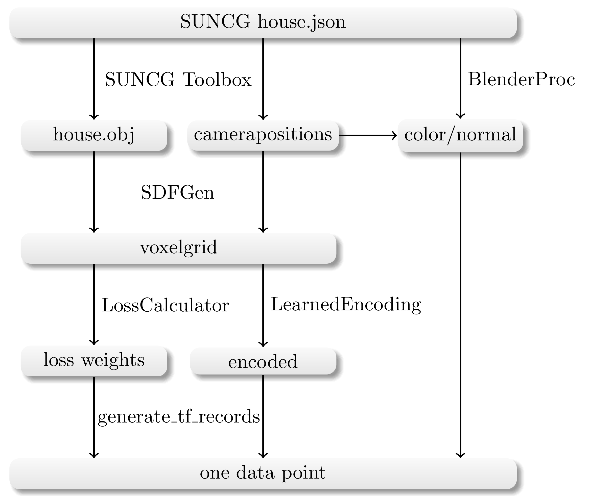

# Single View Reconstruction

In this module we can train and predict based on one color image and a corresponding normal image a complete 3D scene.

## Pretrained model

First, we will describe on how to use our pretrained model, to predict new datapoints.

For that please download the model use this [script](../download_models.py).

After that you can use, this model on any color image generated by the [BlenderProc](../BlenderProc) config file.
You will also need a corresponding normal image of the depicted scene, you can either use the generated one from BlenderProc or you can use [UNetNormalGen](../UNetNormalGen) do generate a normal image based on this color image.

So assuming you can now try the predict with such an `.hdf5` container, which contains a `"colors"` and `"normals"` or `"normal_gen"` key.

```shell script
python predict_datapoint.py 
```

## Evaluation 

We compute several different metrics between two `.hdf5` containers. 

In order to calculate the hausdorff distance we used the meshlabserver.
For that just install meshlab:

```shell script
sudo apt install meshlab
```

And then you should be able to run a comparison between a predicted `.hdf5` container and a true `.hdf5` container with the following command:

```shell script
python scripts/calcMetrics.py --true TRUE.hdf5 --test TEST.hdf5 --meshlab_path /usr/bin/meshlabserver
```

Be aware that this can take some minutes per scene.

## Train your own model

### Data generation

Be aware that you generated all needed parts, see this overview again:

<p align="center">

</p>

After that you can use the [generate_tf_records.py](generate_tf_records.py) to create a new `data` folder in side 
of this `SingleViewReconstruction` folder, which will contain the `.tfrecords`.

## Training the model

After generating the training data you can start the training, it might be that you need to decrease the batch size:

Make sure to be in the directory: [SingleViewReconstruction/SingleViewReconstruction](../SingleViewReconstruction).

```shell script
python train.py
```

The logs will be saved in the `logs/` folder, where also the model will be saved every 10 minutes.

